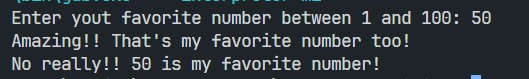

# Challenge

The challenge is to create a program that asks the user to enter their favourite number between 1 and 100. The program then checks whether the number entered is valid and displays an appropriate message.

## Instructions

1. Ask the user to enter their favourite number between 1 and 100.
2. Check that the number entered is an integer between 1 and 100.
3. If the number is invalid, display the message "The number is not between 1 and 100" and end the programme.
4. If the number is valid, display the messages "Incredible! It's my favourite number too!" and "No really! [favourite_number] is my favourite number!", where [favourite_number] is the number entered by the user.
5. End the program.

## Example

