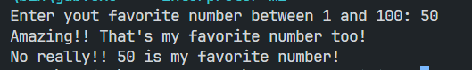

# Challenge

Le défi consiste à créer un programme qui demande à l'utilisateur d'entrer son nombre préféré entre 1 et 100. Ensuite, le programme vérifie si le nombre entré est valide et affiche un message approprié.

## Instructions

1. Demandez à l'utilisateur d'entrer son nombre préféré entre 1 et 100.
2. Vérifiez si le nombre entré est un entier entre 1 et 100.
3. Si le nombre n'est pas valide, affichez le message "Le nombre n'est pas entre 1 et 100" et terminez le programme.
4. Si le nombre est valide, affichez les messages "Incroyable !! C'est aussi mon nombre préféré !" et "Non vraiment !! [favorite_number] est mon nombre préféré !", où [favorite_number] est le nombre entré par l'utilisateur.
5. Terminez le programme.

## Exemple

